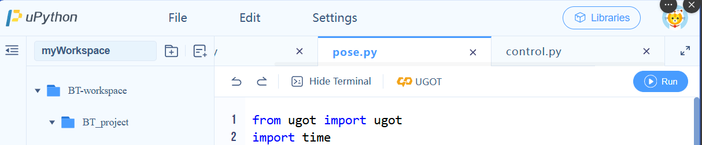
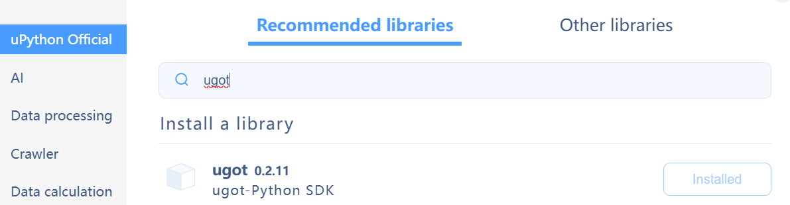

# UGoT Robotic Kit Programs
A collection of python programs for UGoT Robotic Kit by UBTech: https://www.kickstarter.com/projects/ubtech/ugot-robotic-kit-future-crafted-now

## Steps to use these programs
1. Clone this repository on your computer.
2. Go to https://py.ubtrobot.com/#/ to open the uPython online code editor.
3. Go to "File" and "Open from local", then select the repository folder that you cloned. Now the `ugot-programs` folder should appear in the `myWorkspace` view on the left panel.
4. Select and open a program (.py) from the `programs/` folder, and click the yellow "UGOT" button, under the filename.

    - If this button is not visible, go to `Libraries` on the top-right corner and make sure `ugot` python SDK is installed.
    
5. `Connect to UGOT`, and enter the robot's IP address in the terminal. The IP address can be found from the robot `Settings`->`About` section.
6. The robot should now be connected.

### Note

1. You can use the `Run` button to test your code. It runs the code on the robot/main controller board and shows the output in the terminal online.
2. To deploy the program to the robot, click on the `UGOT` button and click `Upload`. Now you can find the program from the robot's `Programs` UI. Alternatively, you can also `Upload and Run` to immediately run your code on the robot.

### Official documentation by UBTech
https://docs.ubtrobot.com/ugot/#/en-us/

## Credits/Trademark/Copyrights

[UBTech][1] owns the rights to the UGOT Robotic Kit and related names like `uPython` and `uCode`.

[1]: https://www.ubtrobot.com/aiEducation/products/ugot